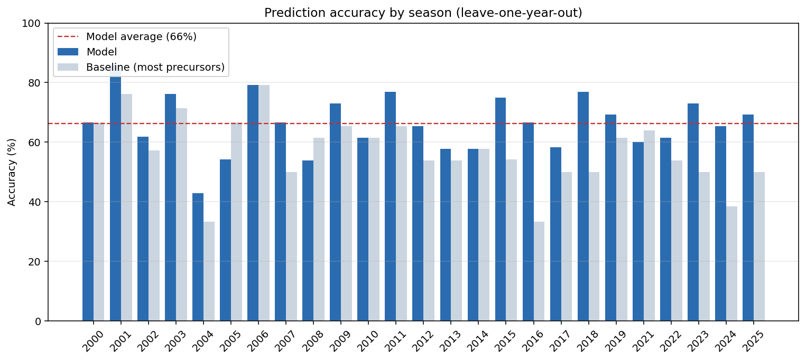
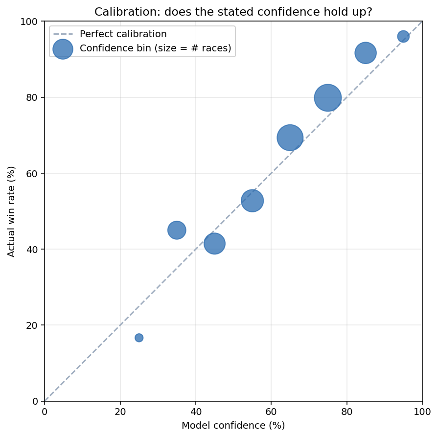
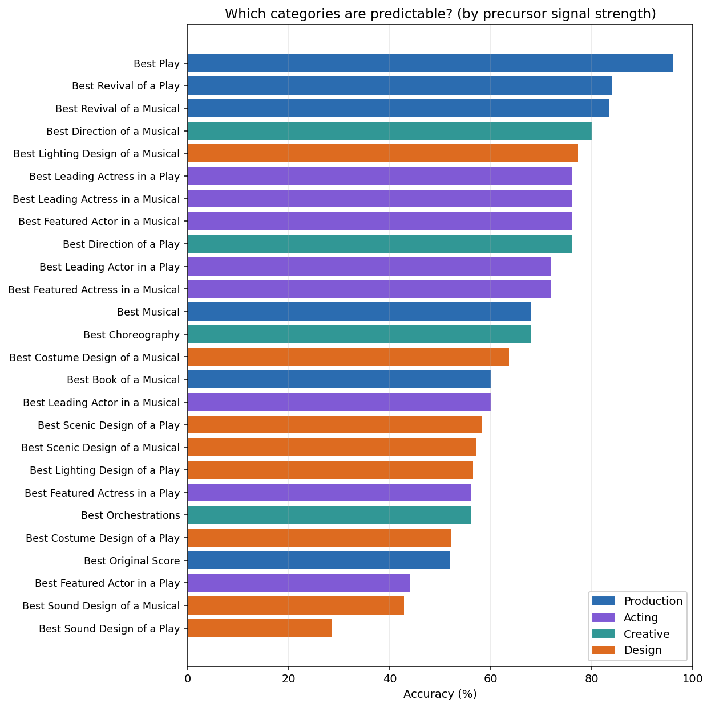

# Tony Awards Predictor

I wanted to see how well you can predict the Tony Awards using only the
information available *before* the ceremony - mainly the precursor awards
(Drama Desk, Outer Critics Circle, Drama League, NY Drama Critics' Circle) that
get handed out in the weeks leading up to the Tonys, plus a few public signals
about each show. This repo is the result: a model trained on 26 seasons
(2000-2026) that picks a winner in all 26 competitive categories.

It lands at **~65% accuracy** in leave-one-year-out backtesting - well over 2x
better than guessing, and +8 points over the obvious "whoever won the most
precursors" baseline.

## How it works

For each category, the model asks: of this year's nominees, which one do the
pre-ceremony signals favor - weighted by how reliably each signal has predicted
the Tony in the past? It's a **naive-Bayes log-likelihood vote**:

- Every signal (e.g. "won the Drama Desk in the matching category") gets a
  weight equal to `log( P(signal | eventual winner) / P(signal | eventual
  loser) )`, learned from past seasons. Strong signals earn big weights; noisy
  ones earn ~0.
- Each nominee's signals are summed, then a softmax within the category turns
  the scores into win probabilities that add to 1.

I tried fancier models (logistic regression, random forest, gradient boosting,
and a hierarchical partial-pooling variant) - they all either *overfit* on the
correlated data or failed to beat the simple version. The weighted vote wins,
and it has the nice property of being completely explainable: you can see
exactly which signals backed each pick.

## The signals

1. **Precursor awards** - wins and nominations across the four major
   pre-Tony bodies, mapped category-by-category (this mapping is fiddly: the
   precursors split/merge categories differently, use gender-neutral combined
   acting awards, and mix in Off-Broadway productions that have to be filtered
   out).
2. **Frontrunner / "sweep"** - whether a nominee's show leads its category in
   total Tony nominations. The sweep effect is real and worth ~+2.5 points,
   mostly in the harder design and acting races.
3. **External per-show data** - pre-ceremony critical reception, commercial
   status (still running? hit or flop?), and the pundit/odds favorite. Worth
   another ~+4 points.
4. **Transfer history** - whether a show won an Olivier for the same West End
   production before transferring, or won major Off-Broadway awards in a prior
   season. This set of signals did NOT move the needle in backtesting (the
   precursors already capture most of that momentum), but I included it so the
   model explicitly accounts for the London / Off-Broadway pipeline instead of
   pretending a show's pre-Broadway life never happened.
5. **Consensus strength** - how unanimous the precursor agreement was, not just
   which bodies were won. Flat on overall accuracy, but it fixes a specific
   failure: the model used to underrate universal favorites (a clean sweep that
   every pundit agrees on would only score ~79%). Now those land near-certain.
6. **Historical pundit/odds favorite** - for each past season, who the experts
   predicted to win each category, sourced pre-ceremony (Gold Derby via the
   Wayback Machine, Slant, NPR). This was the single biggest accuracy gain
   (+2.6 points). Strong pundit consensus is hard to beat.

### A note on calibration

The raw model scores saturate near 100% when every signal lines up, which is
over-confident. So predictions also carry a **calibrated** probability: the raw
score mapped onto how often such picks have actually won historically (isotonic
regression fit out-of-fold, never in-sample). The prediction sheet shows both;
the calibrated number is the honest one. This is a ranking-preserving rescale,
so it makes the percentages truthful without changing which nominee is picked.

### A note on time-locking

Every external signal is recorded **as of Tony ceremony day only**. This
matters more than it sounds: a flop that closes the week *after* losing must
not be marked "closed" in the data, or you leak the result backward and inflate
the accuracy. There's a leak guard in `external.py` that flags any feature
correlating too cleanly with winning (real pre-ceremony signals are noisy - the
"pundit favorite" flag, for instance, is only right ~46% of the time, which is
exactly what a legitimate signal looks like).

## Layout

```
src/
  categories.py     26 Tony categories + the precursor crosswalk
  schema.py         data structures + name normalization
  matcher.py        entity matching + feature extraction
  model.py          the naive-Bayes log-likelihood model
  validate.py       leave-one-year-out backtest (+ baseline + calibration)
  ingest.py         turn raw collected data into season files
  predict.py        fit on history, rank a target year
  make_sheet.py     render the printable prediction sheet
  make_charts.py    render the chart set (PNGs) into output/charts/
  analytics.py      year/category/calibration metrics (one source of truth)
  calibrate.py      isotonic probability calibration (out-of-fold)
  votesplit.py      optional vote-splitting heuristic (predict-time only)
  model_hier.py     hierarchical partial-pooling variant (tested, not adopted)
  inspect_season.py diagnostic: which signals backed each winner
  external.py       integrate + leak-test the external per-show data
  experiments.py    feature experiments (what helped, what didn't)
  experiments_v2.py model-family bake-off
  experiments_v3.py full ablation: every feature group's contribution
data/
  raw/season_<year>.json   one file per ceremony year
  external_shows.json      per-show commercial/critical/pundit data
  transfers.json           Olivier / Off-Broadway transfer signals
  odds.json                per-category historical pundit/odds favorites
output/
  predictions_2026.json    machine-readable predictions
  PREDICTIONS_2026.md       the printable sheet
  charts/                   generated charts (see below)
```

## Running it

```bash
cd src
python3 validate.py          # backtest accuracy on past seasons
python3 predict.py 2026      # predict a season
python3 make_sheet.py 2026   # render the printable sheet
python3 make_charts.py       # render all charts to output/charts/
python3 analytics.py         # print the headline metrics
python3 inspect_season.py 2025   # sanity-check the signal matching
```

Requires Python 3.10+, numpy, scikit-learn, scipy, matplotlib. (The core model
is pure Python; scikit-learn/scipy are only for the model-family experiments and
matplotlib only for the charts.)

## Charts

`python3 make_charts.py` regenerates all of these into `output/charts/`:



Accuracy holds up season to season, consistently at or above the
"most-precursors" baseline.



The calibration plot is the honest gut-check: each dot is a confidence bin, and
the closer to the diagonal the better. The model is well-calibrated at the high
end (its locks land ~80%+) and runs a little over-confident in the middle.



Some categories (Best Play, lead acting in plays, direction) are highly
predictable from precursors; design and sound are closer to coin-flips.

The remaining charts - `accuracy_by_group.png`, `confidence_scatter.png`, and
`forecast_2026.png` - cover accuracy by category type, every individual race's
confidence-vs-outcome, and the ranked 2026 forecast.

## What I'd add next

The biggest untapped lever is **category-level betting-market odds** (the
current pundit signal is tracked per show, which is blunt - a show sweeping the
nominations lifts all its nominees). Real money lines, if you can source them
historically, would almost certainly push past 65%.

## Caveats

- The model runs a little over-confident in the middle of its range - read a
  95% as "very likely," not literal odds. The top confidence tier (>70%) is
  well-calibrated at ~79% actual.
- Best Musical 2026 scores as a lock but was a genuine three-way race in the
  pre-ceremony coverage; treat it as the softest of the locks.
- Design and sound categories are the hardest to call - the precursors and the
  Tony voters genuinely diverge there.
